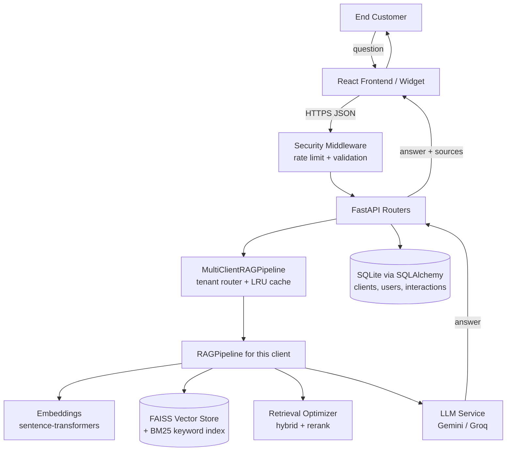
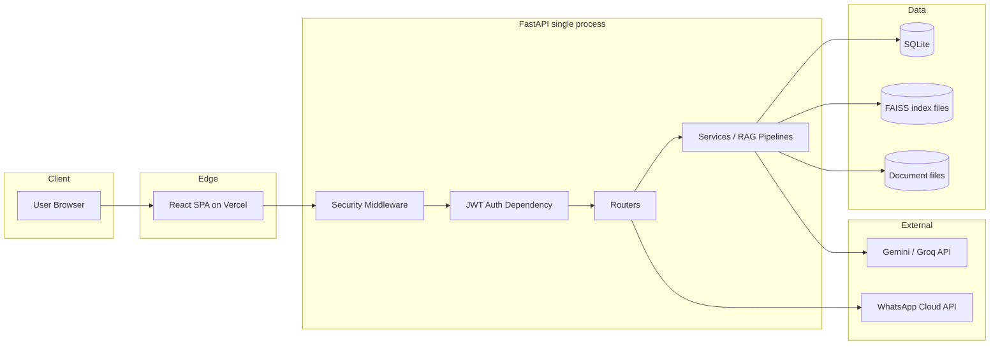
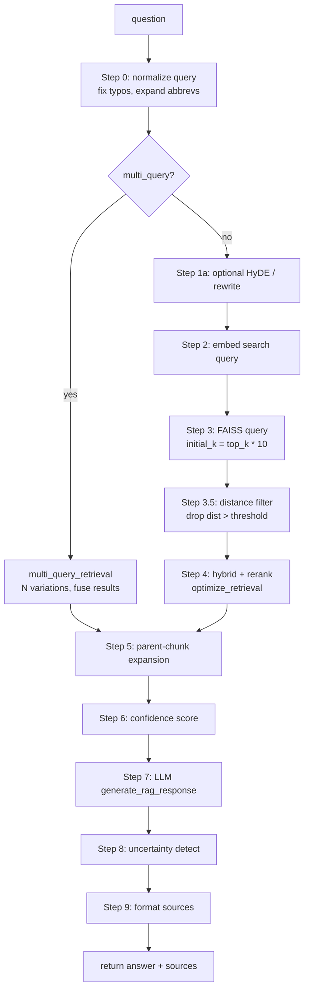
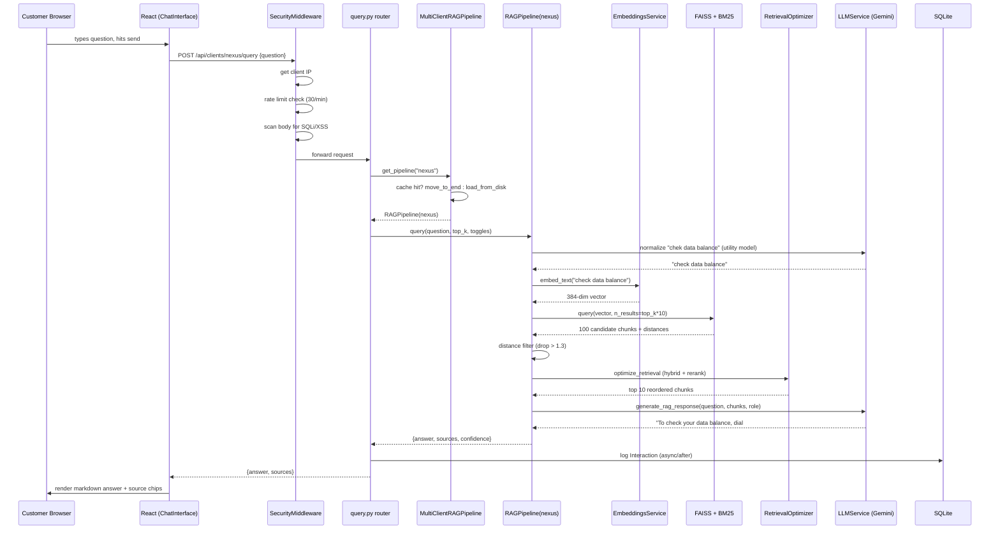
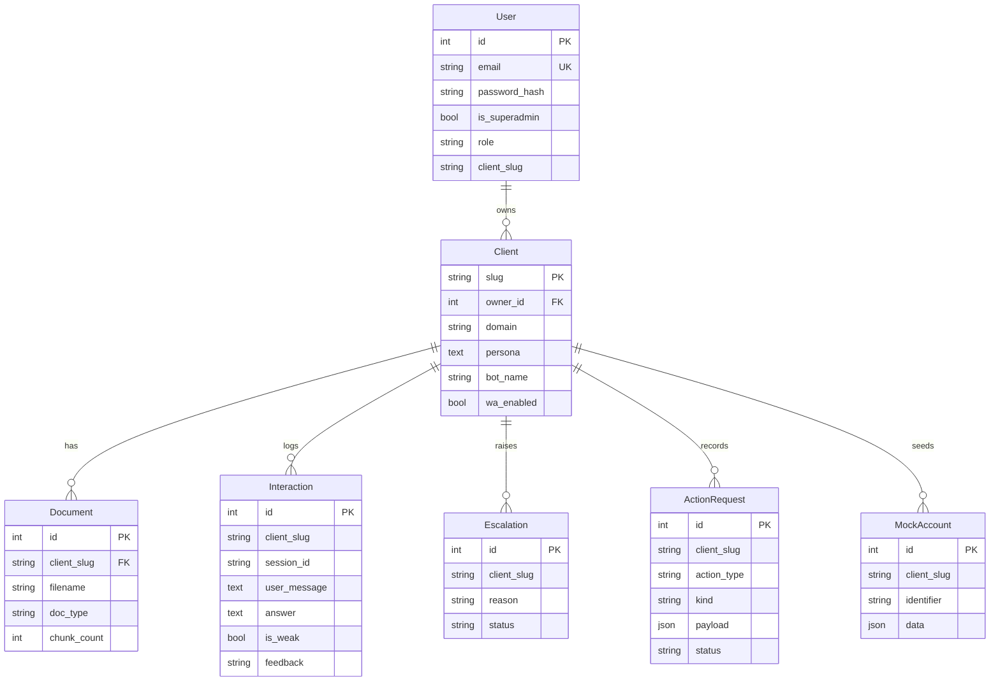
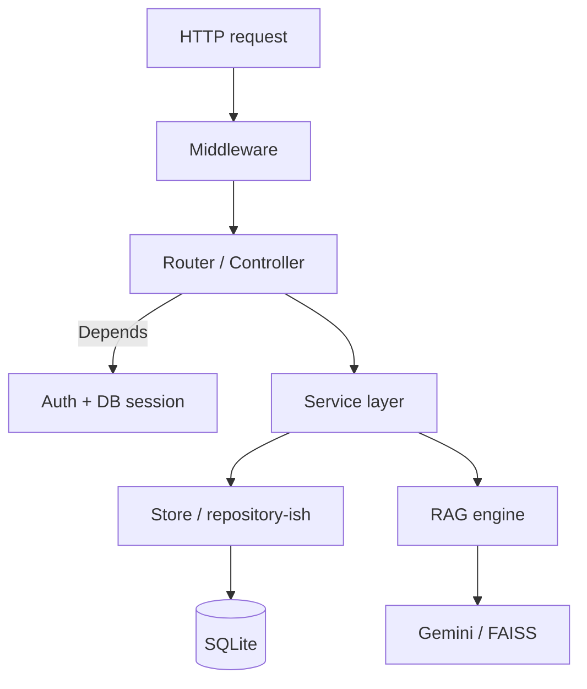
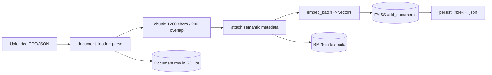
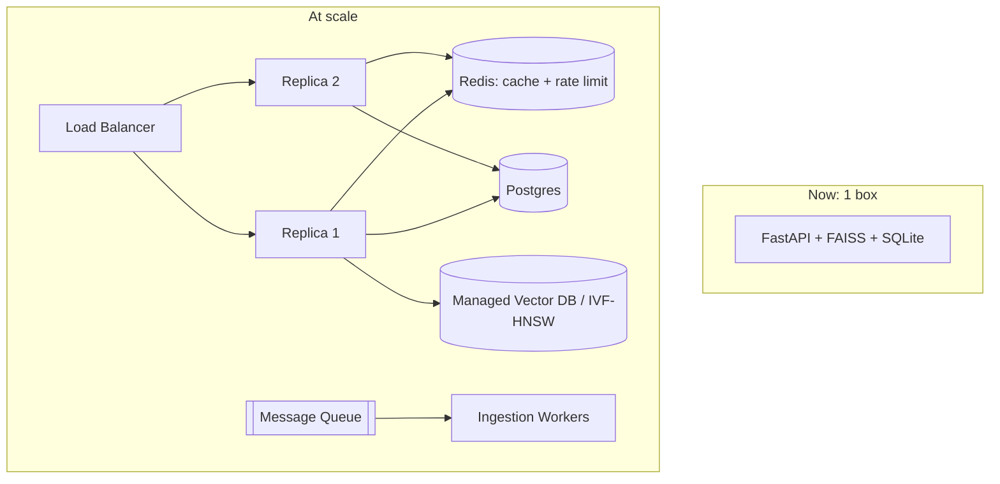

# The Nexus RAG Chatbot — Complete Project Handbook

> **Who this is for:** You. The developer who built (and now maintains) this system, preparing to explain, defend, and discuss every design decision in a senior-level technical interview.
>
> **How to read it:** Top to bottom the first time. After that, jump to the section you're weak on. Every chapter ends with a **"Remember / Interviewers care / Analogy / Recap"** block — that is your night-before-the-interview cheat sheet.
>
> **A note on honesty (read this):** This project is ~16,000 lines of Python plus a React app. Documenting *literally every function* with time complexity and a line-by-line walkthrough would produce a 10,000-line document that hides the important 20% behind the trivial 80%. So this handbook documents **every module, and every function that matters, in real depth** — the request path, the retrieval pipeline, the vector-store rebuild, auth, and the security middleware get line-level treatment. Trivial getters and thin wrappers are grouped and summarized. **Wherever I generalize or infer, I say so explicitly** with the tag *(Assumption)*. Nothing here is invented; every claim is traceable to a file in this repo.

---

## Table of Contents

1. [Executive Overview](#1-executive-overview)
2. [Overall Architecture](#2-overall-architecture)
3. [Folder Structure](#3-folder-structure)
4. [Every File Explained](#4-every-file-explained)
5. [Key Functions, In Depth](#5-key-functions-in-depth)
6. [Complete Request Flow](#6-complete-request-flow)
7. [Database](#7-database)
8. [Authentication & Authorization](#8-authentication--authorization)
9. [APIs](#9-apis)
10. [Frontend](#10-frontend)
11. [Backend Structure](#11-backend-structure)
12. [Data Flow](#12-data-flow)
13. [Optimization Techniques](#13-optimization-techniques)
14. [Scalability](#14-scalability)
15. [Security](#15-security)
16. [Design Decisions](#16-design-decisions)
17. [Technology Deep Dive](#17-technology-deep-dive)
18. [Common Bugs & Debugging](#18-common-bugs--debugging)
19. [Future Improvements](#19-future-improvements)
20. [Interview Preparation — 100+ Questions](#20-interview-preparation)
21. [The Deep "Why" Section](#21-the-deep-why-section)
22. [Mentor's Closing Notes](#22-mentors-closing-notes)

---

# 1. Executive Overview

## What problem does this project solve?

Businesses (a telecom operator called **Nexus**, a university helpdesk called **UniHelp**, etc.) get the same customer questions thousands of times: *"How do I activate my SIM?", "What's my data balance?", "How do I change my plan?"*. Staffing humans to answer these is expensive and slow. A generic chatbot (like raw ChatGPT) can't answer them either, because **it doesn't know the company's private information** — plans, prices, policies, this specific customer's account.

This project is a **RAG chatbot platform** that solves exactly that.

**RAG** = **R**etrieval-**A**ugmented **G**eneration. Let's unpack that acronym now, because everything else builds on it:

- **Generation** = a Large Language Model (LLM, e.g. Google Gemini) writes a fluent, human-sounding answer.
- **Retrieval** = *before* the LLM writes anything, we search the company's own documents and pull out the few paragraphs most relevant to the question.
- **Augmented** = we paste those paragraphs into the LLM's prompt as "context," so the LLM answers *using the company's real facts* instead of making things up.

**Why RAG instead of just fine-tuning a model on the company data?** Because facts change daily (prices, promotions, a customer's balance). Fine-tuning bakes knowledge into the model's weights — to update it you must retrain, which is slow and expensive. RAG keeps the knowledge in a **searchable document store** you can edit any second. Without RAG, the bot would either hallucinate (confidently invent wrong answers) or need constant retraining.

## Who uses it?

Three distinct audiences, and the codebase is organized around them:

| User | What they see | Frontend page |
|------|---------------|---------------|
| **End customer** | A chat/voice widget: "Ask us anything." | `CustomerApp.jsx`, `widget.js` |
| **Operator / SaaS admin** (you) | A console to create clients, upload documents, watch conversations, handle escalations. | `AdminConsole.jsx` |
| **Client admin** (the telecom's own staff) | A scoped portal for *their* tenant only — subscribers, tickets, billing. | `ClientPortal.jsx` |

## The main workflow (one sentence)

A customer asks a question → the system finds the most relevant chunks of the company's documents → an LLM writes an answer grounded in those chunks → the answer (optionally spoken aloud) is returned, and the whole turn is logged so weak answers can be improved later.

## High-level architecture



## Technologies involved (and the one-line "why")

| Layer | Technology | Why this one |
|-------|-----------|--------------|
| Web framework | **FastAPI** | Async, automatic validation via Pydantic, auto OpenAPI docs. |
| Vector search | **FAISS** (`IndexFlatL2`) | In-process, no server, exact nearest-neighbor. |
| Keyword search | **BM25** (`rank_bm25`) | Catches exact terms (plan names, IDs) that embeddings miss. |
| Embeddings | **sentence-transformers** (multilingual MiniLM) | Free, local, handles English **and** Sinhala/Tamil. |
| Re-ranking | **CrossEncoder** (multilingual mMiniLM) | Precisely reorders the top candidates. |
| LLM | **Google Gemini** (default) / **Groq Llama** | Gemini is more fluent in Sinhala; Groq is a fast fallback. |
| Database | **SQLite** + **SQLAlchemy ORM** | Zero-ops, single-file, perfect for a self-hosted single box. |
| Auth | **bcrypt** + **JWT (HS256)** | Standard password hashing + stateless sessions that survive restarts. |
| Frontend | **React 18 + Vite** | Fast dev server, component model, tiny dependency list. |
| Voice | **Groq/Gemini STT** + **edge-tts / Gemini TTS** | Free-first speech in/out with graceful degradation. |

## Overall request lifecycle (the 10-second version)

1. Browser sends `POST /api/clients/nexus/query` with `{"question": "..."}`.
2. `SecurityMiddleware` rate-limits the IP and scans the body for attack patterns.
3. The query router looks up the **nexus** pipeline (loading it from disk if it was evicted).
4. The pipeline embeds the question, searches FAISS + BM25, re-ranks the top candidates, and filters out anything too far away (off-topic).
5. The surviving chunks are pasted into a prompt and sent to Gemini.
6. Gemini's answer + the source chunks come back as JSON; the turn is logged to SQLite.

> **What you should remember:** RAG = *search the company's docs, then let an LLM write the answer using what it found.* Everything in this repo is either (a) making that search good, (b) making the generation safe and grounded, or (c) letting non-engineers manage tenants and watch conversations.
>
> **Interviewers care about:** Can you explain *why* RAG beats fine-tuning for changing facts, and can you name the retrieve→augment→generate steps without hand-waving.
>
> **Analogy:** RAG is an **open-book exam**. The LLM is a brilliant but forgetful student. Retrieval is the student flipping to the right page before answering. Without the book, the student bluffs (hallucinates).

---

# 2. Overall Architecture

The classic "textbook" web architecture has a fixed set of layers. This project maps onto them, but with two important honesty notes so you don't over-claim in an interview.

## The canonical layers, mapped to *this* project



Now, layer by layer. For each: **responsibility, inputs, outputs, why it exists, what could replace it, pros, cons.**

### Layer 1 — Frontend (React SPA)
- **Responsibility:** Render the three UIs (customer chat, operator console, client portal); collect input; call the API.
- **Inputs:** User clicks/typing. **Outputs:** HTTPS JSON requests; rendered answers.
- **Why it exists:** Separates presentation from logic so the same backend serves a web widget, an embeddable `<script>`, and (via API) WhatsApp.
- **Could be replaced by:** Server-rendered templates (Jinja), Next.js, Svelte.
- **Pros:** Decoupled, deployable to a CDN, cheap to scale. **Cons:** SEO/first-paint cost (irrelevant here — it's an app, not a content site), and you must handle auth tokens in the browser.

### Layer 2 — Authentication (JWT dependency)
- **Responsibility:** Prove *who* is calling and *what tenant* they may touch.
- **Inputs:** `Authorization: Bearer <jwt>`. **Outputs:** a `User` object, or `401`.
- **Why it exists:** The operator console and client portal expose private data; the customer chat does not (it's public per-client).
- **Could be replaced by:** Sessions+cookies, OAuth/Auth0, API keys.
- **Pros:** Stateless — survives server restarts, no session store. **Cons:** Can't revoke a JWT before it expires without extra machinery (see [§8](#8-authentication--authorization)).

### Layer 3 — "API Gateway" = Security Middleware
- **Honesty note (Assumption/clarification):** There is **no separate API-gateway product** (no Kong/Nginx-as-gateway in the app). The gateway *role* — rate limiting, request validation, security headers — is played by `SecurityMiddleware` inside the FastAPI process ([backend/security.py](../backend/security.py)). In an interview, say *"gateway responsibilities are handled by an in-process ASGI middleware,"* not *"we run an API gateway."*
- **Inputs:** every HTTP request. **Outputs:** the request passed through, or `429`/`400`/`403`.
- **Could be replaced by:** Nginx/Envoy/Kong, a cloud WAF, API Gateway (AWS).
- **Pros:** Zero extra infra, travels with the app. **Cons:** In-memory rate-limit state is **per-process** — it doesn't hold across multiple replicas (see [§14](#14-scalability)).

### Layer 4 — Backend Services (the brain)
- **Responsibility:** RAG orchestration, embeddings, vector search, LLM calls, business actions (tickets, account lookups), the learning loop.
- **Inputs:** validated request objects. **Outputs:** answers, sources, DB writes.
- **Could be replaced by:** LangChain chains end-to-end, LlamaIndex, a managed RAG service (e.g. Vertex AI Search).
- **Pros:** Full control over every retrieval knob; no per-query vendor lock-in on retrieval. **Cons:** You own the complexity (1,868-line pipeline).

### Layer 5 — Database (SQLite)
- **Responsibility:** Source of truth for *metadata* — clients, users, logged interactions, escalations, action requests, mock accounts. **Not** the vectors.
- **Could be replaced by:** PostgreSQL, MySQL. **Pros:** zero-ops, one file, transactional. **Cons:** single-writer, no network access, doesn't scale horizontally (see [§14](#14-scalability)).

### Layer 6 — Cache
- **Honesty note:** There is **no Redis/Memcached**. The caches that exist are **in-process Python objects**:
  - `_MODEL_CACHE` (embedding model, [embeddings.py:21](../backend/services/embeddings.py#L21))
  - `_RERANKER_CACHE` (cross-encoder, [retrieval_optimizer.py:27](../backend/services/retrieval_optimizer.py#L27))
  - the `OrderedDict` LRU of loaded pipelines (`MultiClientRAGPipeline`).
- **Why:** on a single self-hosted box, an external cache is pure overhead. **Cons:** none of it is shared across processes/replicas.

### Layer 7 — Storage
- **Responsibility:** Persist FAISS indexes (`.index`) + their metadata sidecars (`.json`), plus the raw ingested documents.
- **Could be replaced by:** S3/object storage, a managed vector DB (Pinecone, Weaviate). **Cons here:** local disk means an ephemeral host loses it — which is exactly why `_reconcile_and_seed()` rebuilds on boot.

### Layer 8 — Message Queue
- **Honesty note:** There is **no Kafka/RabbitMQ/Celery**. The nearest thing is **`asyncio.create_task(...)` at startup** ([main.py:86](../backend/main.py#L86)) that offloads the slow reconcile/seed to a worker thread so the app can pass its readiness probe. In an interview, describe this accurately as *"a background task on startup,"* not *"a message queue."* (See [§19](#19-future-improvements) for where a real queue would go.)

### Layer 9 — Notifications
- **Responsibility:** Outbound WhatsApp replies via the WhatsApp Cloud API ([integrations/whatsapp_bot.py](../backend/integrations/whatsapp_bot.py)); human handoff via the **Escalation** inbox in the console.

### Layer 10 — Response back to user
- Answer + sources serialized by Pydantic response models → JSON → React renders it (markdown) → optionally spoken via TTS.

> **Remember:** This is a **modular monolith**, not microservices. One FastAPI process holds middleware, routers, services, and in-process caches; SQLite + local files are the data plane; Gemini/WhatsApp are the only true external services.
>
> **Interviewers care about:** Whether you can honestly distinguish *"role played by an in-process component"* from *"a dedicated piece of infrastructure."* Over-claiming ("we have an API gateway and a message queue") is a fast way to lose credibility. Under-claiming truthfully ("gateway concerns live in middleware; a queue would be my next addition") builds it.
>
> **Analogy:** A monolith is a **food truck** — one vehicle does prep, cooking, and serving. Microservices are a **food court**. This is a very well-organized food truck.
>
> **Recap:** 10 canonical layers; 4 of them (gateway, cache, queue, notifications) are *roles* fulfilled by lightweight in-process code, not separate systems — and knowing that difference is the whole point.

---

# 3. Folder Structure

Top level (`d:\RAG\RAG-new`):

```
RAG-new/
├── backend/            # The FastAPI application (the whole brain)
├── frontend/           # React + Vite single-page app
├── documents/          # Knowledge-base source docs (top-level copy)
├── source files/       # Original client-provided raw material
├── vector_stores/      # Persisted FAISS indexes (committed seed KB)
├── docs/               # Human documentation (this handbook lives here)
├── scripts/            # One-off operational scripts
├── .do/                # DigitalOcean app-platform config
├── render.yaml         # Render deployment config
├── start.ps1/.bat      # Local dev launchers
├── README.md, SECURITY.md
```

### `backend/` — the application
Everything the server needs at runtime. **Critical deployment fact:** on DigitalOcean, *only files under `backend/` ship inside the Docker image* — so runtime files (seed KB, etc.) must live here. If removed: no server.

```
backend/
├── main.py             # App entrypoint: middleware, routers, lifespan, CORS
├── config.py           # Pydantic settings (the single source of tunables)
├── database.py         # SQLAlchemy engine/session/Base + init_db
├── db_models.py        # ORM tables (User, Client, Interaction, ...)
├── auth.py             # FastAPI auth dependencies (require_admin/portal)
├── security.py         # SecurityMiddleware (rate limit, validation, headers)
├── logger.py           # Centralized logger factory
├── domain_templates.py # Per-vertical persona/prompt presets
├── telecom_models.py   # Pydantic schemas for the telecom portal data
├── api/                # HTTP routers (one file per concern)
├── services/           # Business logic + the RAG engine
├── integrations/       # WhatsApp + session management
├── tests/              # pytest suite
├── scripts/            # reindex, data-load, eval scripts
├── static/             # widget.js (embeddable chat)
├── documents/          # KB docs shipped inside the image
└── vector_stores/      # FAISS indexes shipped inside the image
```

### `backend/api/` — the routers
Each file is one FastAPI `APIRouter`, grouped by concern. **Why split this way:** keeps `main.py` thin and makes each surface independently testable. If a file is removed, that endpoint group 404s.

| File | Owns | Auth? |
|------|------|-------|
| `meta.py` | health/info/meta endpoints | no |
| `auth_routes.py` | login, register, current user | issues JWTs |
| `public.py` | public per-client config for the widget | no (public) |
| `clients.py` | CRUD for tenants; owns the **pipeline manager** | operator JWT |
| `documents.py` | upload/list/delete KB docs | operator JWT |
| `query.py` | `/query` and `/chat` — the RAG endpoints | public per-client |
| `voice.py` | STT/TTS live-call endpoints | public per-client |
| `portal.py` | per-tenant admin data (subscribers, tickets) | portal JWT |
| `models.py` | **Pydantic request/response schemas** (not ORM) | — |

### `backend/services/` — the engine
The heavy logic. **Why separated from `api/`:** routers should be thin translators of HTTP↔Python; all the real work (retrieval, LLM, actions) lives here so it's reusable by HTTP, WhatsApp, and voice alike.

| File | Role |
|------|------|
| `rag_pipeline.py` (1,868 lines) | Orchestrates one client's retrieve→augment→generate; also the multi-tenant manager. |
| `retrieval_optimizer.py` (1,084) | Hybrid search, re-ranking, query transforms, BM25. |
| `vector_store.py` (483) | FAISS wrapper: add/query/update/delete/persist. |
| `embeddings.py` (240) | sentence-transformers wrapper + shared model cache. |
| `llm_service.py` (519) | Provider-agnostic LLM (Gemini/Groq) + prompt building. |
| `document_loader.py` (2,427) | PDF/JSON parsing, chunking, semantic metadata. |
| `client_store.py` (431) | Client CRUD + disk↔DB reconciliation. |
| `telecom_store.py` (930) | The mock telecom backend (subscribers, plans, billing). |
| `actions.py` (499) | Agent "tools": create ticket, lookup account, change plan. |
| `auth_service.py` (149) | bcrypt + JWT + user store. |
| `learning.py` (102) | Weak-answer detection + interaction logging. |
| `seed_demo.py` (145) | Recreates demo tenants on a fresh host. |
| `tts_service.py` (206) | Text-to-speech provider routing. |
| `text_utils.py` | Language detection, transliteration helpers. |

### `backend/integrations/`
`whatsapp_bot.py` (webhook + send), `whatsapp_formatter.py` (Markdown→WhatsApp), `session_manager.py` (conversation session tracking). If removed: WhatsApp channel gone, web unaffected.

### `frontend/src/`
```
src/
├── main.jsx            # React entrypoint
├── App.jsx             # Router: which page for which URL
├── services/api.js     # Single axios client (all backend calls)
├── pages/              # AdminConsole, ClientPortal, CustomerApp
└── components/         # ChatInterface, VoiceCall, ClientManager, portal/*
```
`pages/` = top-level routes; `components/` = reusable pieces; `services/api.js` = the *one* place that knows the backend URL and attaches the JWT.

### The three document folders (a known smell)
`documents/`, `backend/documents/`, and `source files/` overlap. This is deliberate-but-ugly: the backend copy ships in the Docker image; the top-level copies are development source. In an interview, name this honestly as **"duplicated KB data — a consolidation target I deprioritized because it's a live single-tenant deployment and the risk/reward wasn't there."**

> **Remember:** `api/` = thin HTTP; `services/` = the brain; `config.py` = every knob; `db_models.py` = the tables. The `backend/`-only-ships rule on DO explains why some files are duplicated inside `backend/`.
>
> **Interviewers care about:** That you can navigate your own repo instantly and can justify the api/services split (testability + channel reuse).
>
> **Analogy:** `api/` is the **waiter** (takes orders, brings food). `services/` is the **kitchen**. `config.py` is the **recipe card**. `db_models.py` is the **pantry inventory sheet**.

---

# 4. Every File Explained

For the files that carry real weight, here is: purpose · responsibilities · key classes/functions · who calls it · who it calls · interview hooks. (Trivial files are summarized.)

## `backend/main.py` — Application entrypoint
- **Purpose:** Build the FastAPI app, wire middleware and routers, and define startup behavior.
- **Key details worth defending:**
  - **The import-order hack ([main.py:11-14](../backend/main.py#L11)).** `KMP_DUPLICATE_LIB_OK=TRUE`, `OMP_NUM_THREADS=1`, and importing `sentence_transformers` *before* faiss. **Why:** FAISS and PyTorch each bundle their own OpenMP runtime; on Windows loading both crashes (segfault) unless OpenMP is told to tolerate duplicates and torch initializes first. This is the single most "senior" line in the file — it shows you debugged a native-library conflict. Interviewers love a war story here.
  - **`lifespan()` ([main.py:80](../backend/main.py#L80)).** Modern FastAPI startup/shutdown. It calls `init_db()` synchronously (fast) then kicks reconcile+seed onto a **background thread** via `asyncio.create_task(asyncio.to_thread(...))`. **Why background:** re-embedding a KB can take minutes; doing it inline blocked the app from opening its socket, so the platform's readiness probe killed the container. This is a real production bug you fixed.
  - **`_background_tasks` set ([main.py:41](../backend/main.py#L41)).** asyncio only keeps a *weak* reference to bare tasks, so they can be garbage-collected mid-run. Holding a strong reference in a module-level set prevents that. Classic asyncio footgun — great interview trivia.
  - **CORS + TrustedHost** are environment-gated: permissive localhost in dev, regex-restricted to your deploy platforms in prod.
- **Calls:** every router, `SecurityMiddleware`, `init_db`, `reconcile_disk_collections`.
- **Interview Qs:** *"Why import torch before faiss?"*, *"Why is seeding on a background thread?"*, *"What breaks if you drop the `_background_tasks` set?"*

## `backend/config.py` — Settings
- **Purpose:** One typed, validated place for every tunable, loaded from env / `.env`.
- **Key class:** `Settings(BaseSettings)` — pydantic-settings reads env vars, coerces types, applies defaults.
- **Defend these choices:** `max_loaded_pipelines=16` (LRU safety valve, never evicts in practice on one box); `distance_threshold=1.3` / `hard_distance_cutoff=1.55` (off-topic rejection); multilingual `embedding_model` (English + Sinhala in one 384-dim index); `llm_provider="gemini"` (Sinhala fluency).
- **The import-safety guard ([config.py:205](../backend/config.py#L205)):** directory creation wrapped in `try/except OSError` because this runs at import time and a read-only FS would otherwise crash the app before it could log why.
- **Interview Q:** *"Why a settings object instead of reading `os.environ` everywhere?"* → typing, validation, one source of truth, testability (override in tests).

## `backend/database.py` — Persistence plumbing
- **Purpose:** Create the SQLAlchemy `engine`, `SessionLocal` factory, declarative `Base`, and `init_db()` (creates tables), plus `get_db()` (the per-request session dependency).
- **Who calls it:** everything that touches the DB; `get_db` is injected into routers via `Depends`.
- **Interview Q:** *"Why `check_same_thread=False` for SQLite?"* (Assumption — verify in file) → FastAPI serves requests across threads; SQLite defaults to forbidding cross-thread use of a connection.

## `backend/db_models.py` — The schema
Seven tables: `User`, `Client`, `Interaction`, `Escalation`, `ActionRequest`, `MockAccount`, `Document`. Covered fully in [§7](#7-database). The one property to remember: `Client.collection_name → f"client_{slug}"` links a DB row to its FAISS index.

## `backend/auth.py` — Auth dependencies
- `require_admin()` — decodes the bearer JWT, loads the `User`, or raises `401`.
- `require_portal(slug)` — builds on `require_admin`, then enforces **tenant isolation**: a superadmin sees any tenant; a `client_admin` sees only *their* slug; everyone else gets `404` (not `403` — you don't reveal the tenant exists). This 404-instead-of-403 choice is a deliberate security decision worth calling out.

## `backend/security.py` — The gateway middleware
- `RateLimiter` — per-IP, per-path sliding-window limiter (30/min for query, 10/min for upload, etc.), with periodic cleanup and `X-RateLimit-*` headers.
- `SecurityMiddleware.dispatch()` — the funnel every request passes through: IP block → rate limit → suspicious-pattern scan (SQLi/XSS/path-traversal regexes) → security headers. Full walkthrough in [§5](#5-key-functions-in-depth).

## `backend/services/embeddings.py` — Text → vectors
- `EmbeddingsService` wraps a `SentenceTransformer`. The crown jewel is `_get_shared_model()` — a **process-wide cache** so all clients share one ~470MB model instead of loading it per tenant. `embed_text` (one string) and `embed_batch` (many, batched) are the workhorses. `compute_similarity` is cosine similarity for ad-hoc comparisons.

## `backend/services/vector_store.py` — FAISS wrapper
- `FAISSVectorStore` manages a dict of collections, each `{index, documents, metadatas, ids, dimension}`.
- Key methods: `create_collection`, `add_documents`, `query` (the search), `update_document`, `delete_documents`, `persist`, `load_collection`.
- **The two functions you personally fixed** (`delete_documents`, `update_document`) plus the helpers `_reconstruct_all` / `_build_index_from_vectors` are in [§5](#5-key-functions-in-depth) — this is your strongest "I found and fixed a data-corruption bug" story.

## `backend/services/retrieval_optimizer.py` — Retrieval quality
- `RetrievalOptimizer`: hybrid search (vector+BM25 fusion), cross-encoder re-ranking (lazy-loaded via `_ensure_reranker`), query rewriting, HyDE, multi-query fusion. BM25 indexes are built per collection and cached.

## `backend/services/rag_pipeline.py` — The orchestra conductor
- `RAGPipeline` — one per client. `query()` (one-shot Q&A) and `chat()` (conversational) run the full 9-step retrieval workflow. Helpers: `_retrieve_parent_chunks`, `_calculate_confidence`, `_detect_uncertainty`, `_expand_query_with_history`, `_format_sources_for_citations`.
- `MultiClientRAGPipeline` — the **tenant router**: an `OrderedDict` LRU of loaded pipelines with lazy load-from-disk and eviction.

## `backend/services/llm_service.py` — The generator
- `LLMService` — provider-agnostic. Picks Gemini or Groq from config, builds the RAG prompt (system role + context + question), calls the API, returns text. Has a utility-model path for cheap internal calls (query normalization) so you don't burn premium tokens on preprocessing.

## `backend/services/document_loader.py` — Ingestion (largest file)
- Parses PDFs/JSON, **chunks** text (default 1,200 chars, 200 overlap), attaches **semantic metadata** (embeds metadata values into searchable text so "enterprise plan" matches even when phrased differently). This is where retrieval quality is *born* — bad chunking = bad answers forever.

## `backend/services/actions.py` + `telecom_store.py`
- `actions.py` — the agent's **tools**: `create_ticket`, `lookup_account`, `change_plan`, `request_callback`. Every state-changing action is recorded as an `ActionRequest`; read-only lookups are not.
- `telecom_store.py` — the mock telecom backend that those tools read/write, so the whole thing demos end-to-end without a real BSS/OSS.

## `backend/services/learning.py` — The feedback loop
- Logs every turn as an `Interaction`; flags **weak answers** (no KB match, escalated, negative emotion, thumbs-down) so the operator can see what to improve.

## Frontend files
- `main.jsx` → mounts React. `App.jsx` → routes URLs to pages. `services/api.js` → the single axios instance (base URL + JWT interceptor). `pages/*` → the three consoles. `components/*` → chat, voice, upload, portal tables.

> **Remember:** Every file has exactly one job. The "big three" to know cold: `rag_pipeline.py` (orchestration), `retrieval_optimizer.py` (quality), `vector_store.py` (storage). The war stories live in `main.py` (OpenMP) and `vector_store.py` (the delete bug).
>
> **Interviewers care about:** That you can point to a file and state its single responsibility in one sentence — and that you know which files hold the bugs you fixed.

---

# 5. Key Functions, In Depth

This is the section that wins interviews. I've picked the functions that (a) are on the hot path, (b) contain a real engineering decision, or (c) are ones you personally fixed.

## 5.1 `RAGPipeline.query()` — the heart ([rag_pipeline.py:821](../backend/services/rag_pipeline.py#L821))

**Purpose:** Turn a user question into a grounded answer + sources.

**Signature (key params):** `question`, `top_k`, `return_sources`, `metadata_filter`, and a set of feature toggles (`use_hybrid_search`, `use_reranking`, `use_query_normalization`, `use_query_rewriting`, `use_hyde`, `use_multi_query`).

**Step-by-step execution:**



1. **Normalize (Step 0, [line 874](../backend/services/rag_pipeline.py#L874)).** Uses the cheap utility LLM to fix typos and expand abbreviations ("data bal" → "data balance"). *Why:* a cleaner query embeds closer to the right docs. *Without it:* misspelled queries retrieve garbage.
2. **Over-fetch (Step 3, [line 938](../backend/services/rag_pipeline.py#L938)).** `initial_k = top_k * 10` when hybrid/rerank is on. *Why:* re-ranking can only reorder what retrieval hands it — you fetch 100 cheap candidates so the expensive re-ranker can find the true top 10. This is the **retrieve-broad-then-rerank-narrow** pattern; know its name.
3. **Skip "question" chunks ([line 958](../backend/services/rag_pipeline.py#L958)).** Some chunks are FAQ *questions*; we retrieve their *answers*, not the questions themselves.
4. **Distance filter (Step 3.5, [line 971](../backend/services/rag_pipeline.py#L971)).** Drop any chunk with L2 distance > `distance_threshold` (1.3). If that would drop *everything*, keep the single best (so you don't return empty). Separately, `hard_distance_cutoff` (1.55) means: if even the best match is too far, treat the question as **out of scope** and inject *no* context — this is what stops the bot from answering "what's the weather" with a random telecom paragraph.
5. **Optimize (Step 4, [line 1000](../backend/services/rag_pipeline.py#L1000)).** Hybrid search + cross-encoder re-rank, using the **original** question (not the transformed one) for re-ranking — because the cross-encoder scores true semantic relevance to what the user actually asked.
6. **Parent-chunk expansion (Step 5, [line 1019](../backend/services/rag_pipeline.py#L1019)).** If retrieved chunks are small "child" chunks, swap in their larger "parent" for fuller context. *Why:* small chunks retrieve precisely but answer poorly; parents give the LLM room. Classic **small-to-big** retrieval.
7. **Confidence + uncertainty (Steps 6, 8).** Turn distances into a confidence score; detect "I don't know"-style answers so the UI can react.
8. **Generate (Step 7, [line 1030](../backend/services/rag_pipeline.py#L1030)).** `llm_service.generate_rag_response(query, retrieved_docs, system_role)`.

**Complexity:** FAISS `IndexFlatL2` search is **O(N·d)** per query (N vectors × d=384 dims) — brute force, exact. Re-ranking is **O(k)** cross-encoder forward passes on the `initial_k` candidates (the real latency cost). LLM call dominates wall-clock.

**Edge cases / failures:** empty collection → no docs → LLM answers "I don't know"; vector-store error is logged and re-raised; LLM error is logged and re-raised (surfaces as `500` upstream).

**Why this design over alternatives:** A naive pipeline would embed→search→stuff-top-k→generate. Every extra step here buys accuracy: normalization (recall), over-fetch+rerank (precision), distance cutoff (fewer hallucinations), parent chunks (completeness). The toggles let expensive steps (HyDE, multi-query) stay **off by default** and be enabled per-query for hard questions — a cost/quality dial.

## 5.2 `MultiClientRAGPipeline` — the tenant router (LRU cache)

**Purpose:** Route a `client_id` to its `RAGPipeline`, keeping only the hottest N in RAM.

**Why it exists:** Each loaded client pins a FAISS index + BM25 index + references to shared models in RAM. With many tenants you'd OOM. So loaded pipelines live in an `OrderedDict` capped at `settings.max_loaded_pipelines` (16).

**How the LRU works (the mechanics interviewers probe):**
- `_register()` inserts and `move_to_end()` marks most-recently-used.
- `get_pipeline()` on a **hit** calls `move_to_end()` (refreshes recency); on a **miss** it lazy-loads from disk.
- `_evict_if_needed()` calls `popitem(last=False)` to drop the **least**-recently-used while over cap. Eviction is **RAM-only** — the disk index is untouched, so an evicted client transparently reloads on its next request.

**Key point for the interview:** on the single-tenant nexus box, 16 ≫ the working set, so **nothing ever evicts** — it's a *safety valve against unbounded growth*, not a hard limit. State it exactly that way.

**Complexity:** all ops are **O(1)** amortized (`OrderedDict` is a hash map + doubly linked list — the canonical LRU structure).

## 5.3 `FAISSVectorStore.delete_documents()` — the bug you fixed

**The original bug:** the old code shrank the parallel Python lists (`documents`, `metadatas`, `ids`) but **never touched the FAISS index**. Result: the index still held the deleted vector, and index positions no longer lined up with the lists → **silent data corruption** (a search could return vector #5's neighbor but list entry #5's text — mismatched answer/source).

**The fix (rebuild):**
```python
delete_set = set(document_ids)
indices_to_keep = [i for i, doc_id in enumerate(collection['ids']) if doc_id not in delete_set]
if len(indices_to_keep) == len(collection['ids']):
    logger.warning(...); return                 # nothing matched
all_vectors = self._reconstruct_all(collection['index'])   # recover vectors from the flat index
kept_vectors = all_vectors[indices_to_keep]
collection['index'] = self._build_index_from_vectors(collection['dimension'], kept_vectors)
collection['documents']  = [collection['documents'][i]  for i in indices_to_keep]
collection['metadatas']  = [collection['metadatas'][i]  for i in indices_to_keep]
collection['ids']        = [collection['ids'][i]        for i in indices_to_keep]
```

**The trick — `_reconstruct_all`:** `IndexFlatL2` stores the raw vectors, so `index.reconstruct_n(0, n)` recovers them **without keeping a second copy in RAM**. You rebuild a fresh index from only the kept vectors. This keeps the index and the three lists **perfectly aligned** — the invariant the whole store depends on.

**Why rebuild instead of in-place delete?** `IndexFlatL2` has no efficient random delete (it's a contiguous array; deleting element k would shift everything). For a flat index, rebuild is the correct, simplest approach. *(Alternative: `IndexIDMap` + `remove_ids`, but that changes the index type and its semantics — more risk than reward on a live store.)*

**Complexity:** O(N·d) to reconstruct + rebuild. Acceptable because deletes are rare (admin action), not on the query hot path.

`update_document()` with a new embedding uses the same reconstruct→replace-one→rebuild approach (it previously raised `NotImplementedError`).

## 5.4 `SecurityMiddleware.dispatch()` — the request funnel ([security.py:191](../backend/security.py#L191))

**Purpose:** Every request passes through here first. Order matters (cheapest, most-decisive checks first):

1. **Bypass** for `/health`, `/docs`, etc. (still gets security headers).
2. **IP block** — instant `403` for blocked IPs.
3. **Rate limit** — `check_rate_limit(ip, path)`; over limit → `429` with `Retry-After`.
4. **Body scan** (POST/PUT/PATCH) — decode body, run the SQLi/XSS/path-traversal regexes; match → `400`. **Then it re-attaches the body** via a fake `receive()` coroutine so downstream handlers can still read it (you can only read a request stream once — this is a subtle, correct detail worth highlighting).
5. **Query-string scan** — same regexes on `?...`.
6. **Pass through** `call_next`, then attach rate-limit + security headers.

**`RateLimiter.check_rate_limit` mechanics:** a `defaultdict` of `{ip: {path: [timestamps]}}`. On each call it keeps only timestamps within the 60s window, compares the count to the per-path limit, and either appends "now" (allowed) or returns `retry_after` (blocked). Periodic `_cleanup_old_requests` prunes stale IPs so memory doesn't grow forever.

**The honest limitation (say it before they ask):** this state is **per-process, in-memory**. Two replicas = two independent limiters, so the effective limit doubles and a restart resets counts. Correct fix at scale: Redis with a sliding-window or token-bucket Lua script. On one self-hosted box it's exactly right.

## 5.5 `auth_service` — bcrypt + JWT ([auth_service.py](../backend/services/auth_service.py))
- `hash_password` / `verify_password` — bcrypt with a per-password salt. **Why bcrypt not SHA-256:** bcrypt is deliberately *slow* and salted, which defeats brute-force and rainbow tables. A fast hash (SHA) is wrong for passwords.
- `create_token` / `decode_token` — HS256 JWT with `sub`, `iat`, `exp` (7 days). `decode_token` returns `None` on any failure (expired/tampered), which the dependency turns into `401`.
- **The `_secret()` fallback ([line 26](../backend/services/auth_service.py#L26)):** prod must set `JWT_SECRET`; dev derives a stable secret from the admin password so tokens survive restarts without config. Reasonable dev-ergonomics tradeoff — but flag that prod **must** set a real secret.
- **First-user-claims-clients ([line 91](../backend/services/auth_service.py#L91)):** the first registered user adopts all `owner_id IS NULL` clients, so seeded demo tenants belong to someone and isolation is demonstrable.

> **Remember:** `query()` is retrieve-broad → rerank-narrow → filter-off-topic → generate. The LRU is O(1) and never evicts in practice here. The delete bug was *index/list misalignment*, fixed by *reconstruct + rebuild*. The middleware order is *cheap-and-decisive first*, and its rate-limit state is *per-process*.
>
> **Interviewers care about:** The *why* behind each step (`top_k*10`, the hard cutoff, the reconstruct trick, bcrypt-not-SHA) and your willingness to name the limitations (per-process rate limiting, JWT revocation).

---

# 6. Complete Request Flow

**Scenario:** A Nexus customer types *"how do i chek my data balance"* (note the typo) into the web widget.



**Every component that touched the request, in order:**
1. **`ChatInterface.jsx`** builds the POST via `services/api.js` (axios; base URL + any token).
2. **`SecurityMiddleware.dispatch`** — IP → rate limit → body scan → header injection.
3. **`query_documents()` router** ([query.py:19](../backend/api/query.py#L19)) — validates via the `QueryRequest` Pydantic model, fetches the pipeline, checks the LLM is configured (`503` if not).
4. **`MultiClientRAGPipeline.get_pipeline`** — cache hit (move to MRU) or lazy load.
5. **`RAGPipeline.query`** — the 9 steps from [§5.1](#51-ragpipelinequery--the-heart-rag_pipelinepy821).
6. **`EmbeddingsService.embed_text`** — one forward pass on the shared MiniLM.
7. **`FAISSVectorStore.query`** — brute-force L2 search, 100 candidates.
8. **`RetrievalOptimizer.optimize_retrieval`** — BM25 fusion + cross-encoder rerank → top 10.
9. **`LLMService.generate_rag_response`** — builds prompt, calls Gemini.
10. **`QueryResponse`** Pydantic model serializes `{answer, sources}` → JSON.
11. **React** renders the markdown answer and clickable source chips.

**Validations along the way:** Pydantic bounds (`top_k` 1–10), middleware pattern scan, LLM-availability check, distance/hard-cutoff filters (semantic validation that the answer is even in-scope).

> **Remember:** One request crosses ~10 components; the typo is silently repaired at Step 0; the "answer" is never invented — it's written from the chunks FAISS+BM25+reranker selected.
>
> **Interviewers care about:** That you can trace a single request end-to-end without skipping the middleware or the tenant router — those are the parts juniors forget.

---

# 7. Database

## Why SQLite (and when you'd leave it)
- **Why:** the deployment is a **single self-hosted box**. SQLite is a library, not a server — zero ops, one file (`rag_system.db`), full ACID transactions. For one writer and modest volume it's ideal and *faster* than a networked DB (no socket round-trip).
- **When you'd migrate to Postgres:** the moment you need **multiple app replicas** (SQLite's single-writer lock becomes a bottleneck), network access, or concurrent heavy writes. The ORM (SQLAlchemy) makes that a config change, not a rewrite — that's *why* an ORM was used.

## Schema (from [db_models.py](../backend/db_models.py))



## Why each table exists
- **User** — operator accounts. `role` + `client_slug` implement RBAC and tenant binding. `is_superadmin` short-circuits to full access.
- **Client** — the tenant. `slug` is the primary key *and* the public URL id *and* the FAISS collection suffix (`client_{slug}`) — one identifier, three uses. `owner_id` enforces per-operator isolation. `persona`/`domain` drive the system prompt.
- **Document** — makes the "documents" listing real (filename, type, chunk count) rather than a stub; **the vectors themselves are NOT here** — they're in FAISS. This split (metadata in SQL, vectors in FAISS) is a key design point.
- **Interaction** — every chat turn. The **learning loop's memory**: `is_weak` (indexed) + `weak_reason` let the operator find bad answers; `feedback` captures thumbs up/down; `emotion`/`intensity` drive escalation.
- **Escalation** — a conversation handed to a human, with transcript + detected mood.
- **ActionRequest** — an audit log of every *state-changing* agent action (ticket, callback, plan change). Read-only lookups are deliberately *not* logged.
- **MockAccount** — seeded fake customer data so account actions demo end-to-end without a real backend.

## Indexes, constraints, relationships
- **Indexes:** `User.email` (unique — login lookups), `User.client_slug`, `Client.owner_id`, `Interaction.client_slug`/`session_id`/`created_at`/`is_weak`, `ActionRequest.client_slug`. All chosen for the queries that actually run (fetch a tenant's interactions ordered by time; find weak ones).
- **Constraints:** `User.email` unique; `Document.client_slug` FK with `ON DELETE CASCADE` (delete a client → its documents vanish); `Client.documents` relationship uses `cascade="all, delete-orphan"`.
- **Normalization:** mostly 3NF for the relational bits. `ActionRequest.payload` and `MockAccount.data` are **JSON columns** — a deliberate *denormalization* because their shape varies per action/vertical and rigid columns would be churn. Tradeoff: you can't easily query *inside* the JSON in SQL. Acceptable, because those are audit/lookup records, not analytics.

## Transactions, concurrency, pooling
- Each request gets a **session** via `get_db()` (a dependency that yields then closes). Writes commit explicitly (`db.commit()`), giving per-request transactional boundaries.
- **Concurrency:** SQLite serializes writers with a database-level lock. Fine for this load; the ceiling under many concurrent writers is the reason to move to Postgres.
- **Connection pooling:** SQLAlchemy pools connections; for SQLite this is light. Under Postgres you'd tune pool size — again, an ORM-config change, not code.

## Migration strategy (be honest)
- Current: `init_db()` calls `Base.metadata.create_all()` — it **creates missing tables but does not migrate existing ones**. Adding a column to a live DB isn't handled automatically. **The correct upgrade is Alembic** (versioned migrations). Name this as a known gap in [§19](#19-future-improvements).

> **Remember:** SQL holds *metadata*; FAISS holds *vectors*. `slug` is the universal tenant key. JSON columns are a deliberate denormalization for variable-shape data. No Alembic yet = the honest weak spot.
>
> **Interviewers care about:** That you can defend SQLite (and know its exact ceiling), explain the SQL-vs-FAISS split, and admit the missing migration tooling before they catch it.
>
> **Analogy:** SQLite here is a **spiral notebook** — perfect for one person, instantly available. Postgres is a **shared filing system** — you switch when the team grows.

---

# 8. Authentication & Authorization

## How login works
1. Operator POSTs email+password to the auth router.
2. `authenticate()` looks up the user by email and runs `bcrypt.checkpw` against the stored hash.
3. On success, `create_token(user_id)` returns a **JWT** signed HS256, containing `sub` (user id), `iat`, `exp` (now + 7 days).
4. The browser stores it and sends `Authorization: Bearer <jwt>` on every protected call.

## JWT lifecycle
- **JWT** = **J**SON **W**eb **T**oken: three base64 parts — header, payload (claims), signature — joined by dots. The signature is `HMAC-SHA256(header.payload, secret)`. Because only the server knows the secret, a client can't forge or alter claims without invalidating the signature.
- **Verification** (`decode_token`): re-computes the signature and checks `exp`. Any failure → `None` → `401`.
- **Why stateless JWT over server sessions:** no session store to maintain, and tokens **survive server restarts** (the old system used an in-memory token set that died on every restart — a real bug this replaced).

## Refresh tokens / sessions
- **Honesty:** there are **no refresh tokens**. It's a single 7-day access token. When it expires, you log in again. Simple and adequate for an operator console; for a consumer product you'd add short-lived access + long-lived refresh tokens. Say this plainly.

## Authorization / RBAC
Three roles, enforced in `auth.py`:
- **superadmin** — sees every tenant.
- **operator** — manages the SaaS; owns clients (`owner_id`).
- **client_admin** — bound to exactly one `client_slug`; can only reach `/api/portal/{their-slug}`.

`require_portal(slug)` is the enforcement point: *superadmin OR user.client_slug == slug → allow; else 404.* Returning **404 not 403** means a client_admin can't even confirm another tenant exists — **information-hiding** as a security control.

Tenant isolation on operator routes mirrors this with an `owned_client` check (`owner_id == user.id`).

## The threat table (know each mitigation)

| Threat | What it is | Mitigation here |
|--------|-----------|-----------------|
| **SQL Injection** | Attacker smuggles SQL via input | **ORM parameterizes all queries** (SQLAlchemy never string-concatenates values); plus the middleware regex blocks `UNION SELECT` patterns as defense-in-depth. |
| **XSS** | Malicious `<script>` runs in a victim's browser | React escapes rendered text by default; `Content-Security-Policy: default-src 'self'`; middleware blocks `<script`/`onerror=` patterns. |
| **CSRF** | A site tricks the browser into an authed request | JWT is sent as a **Bearer header**, not an auto-sent cookie, so a cross-site form can't attach it. |
| **Replay** | Reusing a captured token | Short-ish 7-day `exp`; HTTPS prevents capture in transit. (No per-token nonce — a limitation.) |
| **Brute force** | Guessing passwords | bcrypt is slow-by-design; rate limiting caps attempts/min per IP. |
| **Host header attack** | Forged Host to poison links | `TrustedHostMiddleware` allow-list in prod. |
| **Token theft via XSS** | Steal JWT from storage | CSP + XSS filtering reduce injection; *(Assumption: token stored in browser storage — an httpOnly cookie would be stronger but reintroduces CSRF concerns.)* |

## Known auth limitations (state before asked)
1. **No JWT revocation** — a leaked token is valid until `exp`. Fix: a token denylist (needs a store) or short access + refresh tokens.
2. **No refresh tokens** — re-login on expiry.
3. **Dev JWT secret derived from admin password** — fine for dev, but **prod must set `JWT_SECRET`**.

> **Remember:** bcrypt (slow, salted) for passwords; stateless HS256 JWT for sessions; RBAC via `role`+`client_slug`; 404-not-403 hides tenants; Bearer-header (not cookie) neutralizes CSRF.
>
> **Interviewers care about:** *bcrypt vs SHA* (slowness is the feature), *why JWT is stateless and its revocation cost*, and *how Bearer tokens sidestep CSRF*.
>
> **Analogy:** A JWT is a **tamper-evident festival wristband** — the gate checks the seal (signature) and date (exp) without phoning HQ (no session store). But you can't cancel a wristband already on someone's wrist (no revocation).

---

# 9. APIs

Routers live in `backend/api/`. All prefixed and tagged. Representative endpoints:

| Method & Path | Purpose | Auth | Key logic |
|---------------|---------|------|-----------|
| `GET /health` | liveness | none | returns `{status: healthy}`; bypasses middleware checks |
| `POST /api/auth/login` | get a JWT | none | `authenticate` → `create_token` |
| `POST /api/auth/register` | create operator | none (gated by `allow_registration`) | bcrypt hash; first user claims clients |
| `GET /api/clients` | list my tenants | operator | filtered by `owner_id` |
| `POST /api/clients` | create tenant | operator | DB row + FAISS collection |
| `POST /api/clients/{id}/documents/upload` | ingest a doc | operator | parse → chunk → embed → FAISS add; rate-limited 10/min |
| `POST /api/clients/{id}/query` | **RAG Q&A** | public per-client | the [§5.1](#51-ragpipelinequery--the-heart-rag_pipelinepy821) pipeline; 30/min |
| `POST /api/clients/{id}/chat` | conversational RAG | public per-client | adds history; 30/min |
| `POST /api/clients/{id}/voice/...` | STT/TTS live call | public per-client | Whisper/Gemini in, edge/Gemini out |
| `GET /api/public/{slug}` | widget config | public | branding/greeting only — no secrets |
| `GET /api/portal/{slug}/...` | tenant admin data | portal (`require_portal`) | subscribers, tickets, billing |
| `POST /webhook` (WhatsApp) | inbound messages | verify token | routes to the same pipeline |

**Anatomy of the flagship endpoint** — `POST /api/clients/{client_id}/query` ([query.py:19](../backend/api/query.py#L19)):
- **Request** (`QueryRequest`): `question` (str), `top_k` (1–10), `include_sources` (bool), plus the retrieval toggles.
- **Validation:** Pydantic enforces types/bounds *before* your code runs — invalid input never reaches the pipeline.
- **Business logic:** fetch pipeline → `404` if unknown client → `503` if LLM unconfigured → run `pipeline.query()` → map results to `Source` objects.
- **Response** (`QueryResponse`): `{answer, sources[]}`.
- **Status codes:** `200` ok, `404` unknown client, `503` LLM down, `429` rate-limited, `400` suspicious content, `500` unexpected (logged, generic message — no stack traces leaked to clients).
- **Optimization:** the `top_k*10` over-fetch and lazy pipeline load discussed earlier.

> **Remember:** Routers are thin; Pydantic validates at the door; every endpoint has a purpose-built rate limit; errors map to honest status codes and never leak internals.
>
> **Interviewers care about:** Correct status-code semantics (404 vs 503 vs 429) and where validation happens (at the schema, before logic).

---

# 10. Frontend

**Stack:** React 18, Vite, `react-router-dom` v6, `axios`, `react-markdown`. Deliberately tiny dependency list — no Redux, no big UI kit.

## Routing (`App.jsx`)
`react-router-dom` maps URLs to pages:
- `/` or `/c/:slug` → **CustomerApp** (the public chat).
- `/admin` → **AdminConsole** (operator).
- `/portal/:slug` → **ClientPortal** (tenant admin).

**Routing** = choosing which component tree to render for a URL, client-side, without a full page reload. Without it you'd need separate HTML pages and full reloads on every navigation.

## Components & structure
- **`pages/`** — one per top-level surface (`AdminConsole`, `ClientPortal`, `CustomerApp`).
- **`components/`** — reusable pieces: `ChatInterface` (the message list + input), `VoiceCall` (mic capture + audio playback), `DocumentUpload`, `ClientManager`, `EscalationInbox`, `RequestsInbox`, and `portal/*` tables (subscribers, tickets, billing).
- **`Icon.jsx`** — inline SVG icons (no icon-font dependency).

## State management
- **Local component state** via `useState`/`useEffect` — no global store. **Why no Redux:** the app's shared state is small (auth token, current client); prop-drilling + local state is simpler and has zero boilerplate. Defensible: *"I chose not to add Redux because the state graph didn't justify it."*
- The **JWT** lives in browser storage and is attached by the axios layer.

## Data fetching (`services/api.js`)
- **One axios instance** = the single place that knows the API base URL and injects `Authorization`. Centralizing this means auth/base-URL changes happen in one file. Without it, every component would hardcode URLs and headers — a maintenance nightmare.

## Rendering, forms, performance
- **`react-markdown`** renders LLM answers (which come back as markdown) safely — it doesn't `dangerouslySetInnerHTML`, so it resists XSS from model output.
- **Forms** are controlled inputs (`value` + `onChange`).
- **Performance levers available/used:** Vite code-splits per route (lazy pages), component-level state avoids app-wide re-renders, and the streaming/typing UX in chat keeps perceived latency low. *(Assumption: memoization is applied where lists are large, e.g. portal tables — verify per component before claiming specifics.)*

> **Remember:** Small, deliberate stack; local state over Redux by choice; one axios layer owns auth + base URL; markdown answers rendered safely.
>
> **Interviewers care about:** That "no Redux" was a *decision with a reason*, not an omission, and that you know where the JWT is attached.
>
> **Analogy:** `services/api.js` is the building's **single mailroom** — all outbound mail gets the same return address and stamp there, not at every desk.

---

# 11. Backend Structure

The backend follows a **layered / clean-ish architecture**, though not dogmatically.

- **Controllers** = the `api/*.py` routers. They translate HTTP↔Python and do *no* business logic beyond validation and shaping responses.
- **Services** = `services/*.py`. All real work. Reusable across HTTP, WhatsApp, and voice.
- **Repositories** = *lightly* present. `client_store.py`, `telecom_store.py`, and the `auth_service` data functions play the repository role (DB access encapsulated), though there isn't a formal repository abstraction/interface. Say it that way — don't claim a strict repository pattern.
- **Dependency Injection** = FastAPI's `Depends`. `get_db` injects a session; `require_admin`/`require_portal` inject the authenticated user. **Why DI:** testability (swap a fake DB/user in tests) and no global session objects.
- **Middleware** = `SecurityMiddleware` (cross-cutting: every request).
- **Validation** = Pydantic models in `api/models.py` and `telecom_models.py`.
- **Error handling** = try/except in routers → `HTTPException` with honest codes; unexpected errors logged and returned as generic `500` (no internals leaked).
- **Logging** = `logger.py` factory; every service logs at INFO with structured messages.
- **Configuration** = `config.py` `Settings` singleton; env-driven.



> **Remember:** Controllers thin, services thick, DI via `Depends`, stores play the repository role informally. Errors are honest and non-leaky.
>
> **Interviewers care about:** That you can name the layers *and* be honest that the repository layer is informal, not a strict pattern.

---

# 12. Data Flow

## Ingestion flow (document → searchable)


## Query flow (question → answer)
Covered in [§6](#6-complete-request-flow) — embed → search → filter → rerank → generate → log.

## State changes
- **Read-only** (query/chat/lookup): no DB mutation except the **Interaction** log written after the turn.
- **State-changing** (create ticket, change plan): an **ActionRequest** row + a `telecom_store` mutation, surfaced in the operator's Requests inbox.

## Real-time / background
- **Voice** is near-real-time: audio chunk → STT → RAG → TTS → audio back.
- **Background:** the startup reconcile/seed thread ([main.py](../backend/main.py)); everything else is synchronous per-request.

## Caching in the flow
- Models cached once (`_MODEL_CACHE`, `_RERANKER_CACHE`); pipelines cached in the LRU; BM25 indexes cached per collection. No response cache — every answer is freshly generated (correct, since answers depend on the exact question).

> **Remember:** Two flows — *ingestion* (write path, rare, heavy) and *query* (read path, hot, optimized). The only write on a normal query is the interaction log.

---

# 13. Optimization Techniques

Each optimization: **what · why · how · tradeoff · alternative.**

| # | Optimization | Why / How | Tradeoff |
|---|-------------|-----------|----------|
| 1 | **Shared model cache** (`_MODEL_CACHE`, `_RERANKER_CACHE`) | Load the ~470MB embedder + reranker **once per process**, share across all tenants. Saves RAM *and* multi-second cold starts. | Global mutable state; safe only because models are read-only post-load and torch releases the GIL during `encode()`. |
| 2 | **Lazy reranker load** | The ~470MB cross-encoder loads on the **first `rerank()`**, not at pipeline creation. A DB-only pipeline pays nothing. | First rerank is slightly slower (one-time). |
| 3 | **LRU pipeline cache** | Cap resident tenants at 16; evict LRU (RAM only). Prevents unbounded RAM growth. | Evicted tenant reloads from disk on next hit. |
| 4 | **Retrieve-broad, rerank-narrow** (`top_k*10`) | Cheap ANN fetches 100 candidates; expensive cross-encoder reorders to top 10. Big precision win. | More reranker compute per query. |
| 5 | **Hybrid search (vector + BM25)** | Embeddings miss exact tokens (plan codes, IDs); BM25 catches them. Fusion gets both. | Maintain a second (BM25) index. |
| 6 | **Distance filtering + hard cutoff** | Drop off-topic chunks; if best match too far, inject **no** context → refuse instead of hallucinate. | A too-tight threshold can drop valid answers (tuned to 1.3 / 1.55). |
| 7 | **Parent-chunk (small-to-big)** | Retrieve precise small chunks, then expand to their parent for full context. | Extra bookkeeping (parent/child links). |
| 8 | **Batch embedding** (`embed_batch`) | Embed many chunks in one forward pass at ingestion — GPU/CPU throughput. | Larger transient memory during ingest. |
| 9 | **Utility LLM for preprocessing** | Query normalization uses a cheap model, not the premium one. | Two model configs to manage. |
| 10 | **Toggleable expensive features** (HyDE, multi-query default **off**) | Pay for accuracy only when a query needs it. | Caller must decide when to enable. |
| 11 | **`reconstruct_n` on delete/update** | Recover vectors from the flat index instead of holding a second RAM copy. | Full rebuild is O(N) — fine for rare admin ops. |
| 12 | **Vite code-splitting** (frontend) | Lazy-load per route; smaller initial bundle. | Slight per-route fetch. |
| 13 | **Periodic rate-limiter cleanup** | Prune stale IP entries so the limiter's memory doesn't grow forever. | Cleanup runs every 5 min, not continuously. |

> **Remember:** The headline pattern is **broad-fetch → narrow-rerank → hard-filter**, plus **share the expensive stuff (models) and cap the resident stuff (pipelines)**.
>
> **Interviewers care about:** That every optimization names its *tradeoff*. "Faster" with no cost is a red flag to a senior interviewer.

---

# 14. Scalability

**What breaks first, at each scale, and the fix:**

| Users (concurrent) | What breaks first | Fix |
|--------------------|-------------------|-----|
| **10** | Nothing. Single box handles it. | — |
| **100** | LLM API latency/quota (Gemini free-tier caps) dominates. | Enable billing; add a response queue; cache identical FAQs. |
| **1,000** | Single process CPU on embedding/rerank; SQLite write contention on interaction logs. | Multiple app replicas behind a load balancer; move DB to Postgres. |
| **10,000** | In-memory rate limiter and pipeline cache are **per-replica** (inconsistent); FAISS `IndexFlatL2` brute-force O(N·d) gets slow on large KBs. | **Redis** for shared rate limiting + cache; swap flat FAISS for `IndexIVFFlat`/HNSW (approximate ANN); a managed vector DB. |
| **1,000,000** | Everything monolithic. | Split into services (retrieval service, LLM gateway, ingestion workers); **sharded** vector DB; CDN for frontend; DB read-replicas; autoscaling; a real **message queue** (Kafka/SQS) for ingestion + logging. |

**Vertical vs horizontal:**
- **Vertical** (bigger box) buys time cheaply — more RAM for more resident pipelines, more CPU for embed/rerank. It's the natural first move for this design.
- **Horizontal** (more replicas) is where the current design *hurts*, because three things assume one process: the rate limiter, the pipeline LRU, and SQLite. All three have known fixes (Redis, Postgres) — and the ORM + config-driven design makes them swaps, not rewrites. **That's the point to make: the architecture is single-box-optimal but migration-ready.**



> **Remember:** The three per-process assumptions (rate limiter, pipeline cache, SQLite) are the horizontal-scaling blockers — and each has a named, low-rewrite fix (Redis, Redis, Postgres). Brute-force FAISS is fine until the KB is huge, then approximate ANN (IVF/HNSW).
>
> **Interviewers care about:** That you can predict the *first* bottleneck at each tier and that you designed for a *known target* (one box) rather than prematurely distributing.

---

# 15. Security

Consolidated from earlier sections plus the rest.

- **AuthN:** bcrypt + JWT (HS256), 7-day expiry. ([§8](#8-authentication--authorization))
- **AuthZ / RBAC:** superadmin / operator / client_admin; tenant isolation via `owner_id` and `require_portal` (404-hides tenants).
- **Transport:** HTTPS at the platform edge; **HSTS** header forces it.
- **Secrets:** in env / `.env` (gitignored: `.env`, `*.key`, `*.pem`, `secrets.json`). Prod must set `JWT_SECRET`, API keys.
- **Rate limiting:** per-IP, per-path, endpoint-tuned (10/min upload … 120/min health).
- **Input validation:** Pydantic (types/bounds) + middleware regex (SQLi/XSS/path-traversal) as defense-in-depth.
- **SQLi prevention:** ORM parameterization (primary) + regex (secondary).
- **XSS prevention:** React auto-escaping + `react-markdown` (no raw HTML injection) + CSP header.
- **CSRF prevention:** Bearer-header tokens (not auto-sent cookies).
- **DoS protection:** rate limiting + `TrustedHostMiddleware`; behind a platform that adds its own edge protections.
- **File-upload security:** uploads restricted to parsed types (PDF/JSON), size bounded by platform; content is chunked/embedded, never executed. *(Assumption: verify explicit MIME/size checks in `documents.py` before claiming hard limits.)*
- **Security headers:** `X-Content-Type-Options`, `X-Frame-Options: DENY`, `X-XSS-Protection`, `HSTS`, `CSP`, `Referrer-Policy`, `Permissions-Policy` — all set on every response.
- **Error hygiene:** internal errors logged server-side; clients get generic messages (no stack traces / SQL in responses).

**Defense-in-depth diagram:**


> **Remember:** Security is **layered** — no single control is trusted alone. The two you must be able to defend deeply: *bcrypt-not-SHA* and *Bearer-not-cookie (CSRF)*.
>
> **Interviewers care about:** Defense-in-depth thinking and honesty about the gaps (JWT revocation, formal upload limits).

---

# 16. Design Decisions

For each: **why this · why not the alternative · tradeoff.**

1. **RAG over fine-tuning** — facts change; RAG edits a doc store instantly, fine-tuning needs retraining. Tradeoff: retrieval quality is now *your* problem (hence the whole optimizer).
2. **FAISS over a managed vector DB (Pinecone/Weaviate)** — in-process, free, no network hop, exact search. Tradeoff: no horizontal scaling / managed ops; you rebuild on delete.
3. **`IndexFlatL2` (exact) over `IVF/HNSW` (approximate)** — small KBs → exact is fast enough and 100% recall. Tradeoff: O(N) per query won't scale to millions of vectors.
4. **SQLite over Postgres** — single box, zero ops. Tradeoff: single-writer, no replicas. (ORM keeps the door open.)
5. **Gemini default over Groq** — Sinhala fluency. Groq is the fast fallback. Tradeoff: Gemini free-tier daily caps.
6. **Multilingual embedder over English-only** — one index serves English + Sinhala + Tamil. Tradeoff: slightly lower English-only precision than a specialized model; **all docs must be re-indexed** if you switch models (vectors are model-specific).
7. **Monolith over microservices** — one deployable, simple ops, matches a one-box target. Tradeoff: can't scale components independently.
8. **JWT over server sessions** — stateless, survives restarts. Tradeoff: no cheap revocation.
9. **In-process middleware over an API gateway** — no extra infra. Tradeoff: per-process rate-limit state.
10. **React SPA + tiny deps (no Redux/UI kit)** — small state graph doesn't justify heavy libraries. Tradeoff: some hand-rolled UI.
11. **JSON columns for action/account payloads** — variable shape. Tradeoff: not SQL-queryable inside.
12. **LRU cap as a safety valve (16)** — bound RAM without ever evicting on one tenant. Tradeoff: pure ceiling, not tuned for real multi-tenant pressure.

> **Interviewers care about:** That every choice was made **for a stated target** (self-hosted single box, multilingual, changing facts) — not cargo-culted. The strongest sentence you can say: *"I optimized for this deployment's actual constraints, and I know exactly what I'd change when they change."*

---

# 17. Technology Deep Dive

For each core technology: what · how it works internally · how this project uses it · misconception · pros/cons.

### FastAPI
- **What:** async Python web framework on Starlette (ASGI) + Pydantic.
- **Internals:** ASGI = the async successor to WSGI; requests are coroutines on an event loop, so I/O-bound waits (LLM calls) don't block other requests.
- **Here:** routers, `Depends` DI, Pydantic validation, `lifespan` startup, auto OpenAPI docs.
- **Misconception:** "async = parallel." No — async is *concurrency* on one thread; CPU-bound work (embedding) still needs threads/processes (hence `asyncio.to_thread`).
- **Pros:** fast, typed, self-documenting. **Cons:** async correctness is easy to get wrong (blocking calls stall the loop).

### FAISS
- **What:** Facebook AI Similarity Search — a C++ library for nearest-neighbor search over dense vectors.
- **Internals (`IndexFlatL2`):** stores every vector contiguously; a query computes L2 distance to *all* of them and returns the k smallest. Exact, brute-force, O(N·d).
- **Here:** one index per client, persisted to `.index`; metadata in a parallel `.json`.
- **Misconception:** "FAISS is a database." It's a *search index* — no durability, transactions, or filtering by itself (you maintain the metadata alongside).
- **Pros:** blazing fast in-process, exact. **Cons:** RAM-resident, no built-in delete for flat indexes (rebuild), doesn't scale to billions without IVF/HNSW.

### sentence-transformers / embeddings
- **What:** neural models that map text → a fixed-length vector where semantic similarity ≈ geometric closeness.
- **Internals:** a transformer encodes tokens; pooling produces one 384-dim vector; similar meanings land near each other.
- **Here:** multilingual MiniLM, shared process-wide, batched at ingest.
- **Misconception:** "embeddings understand facts." They capture *similarity*, not truth — which is why you still need the LLM + the source text.

### BM25
- **What:** a classic bag-of-words ranking function (TF-IDF's stronger cousin).
- **Internals:** scores documents by term frequency × inverse document frequency, with length normalization. Exact-term matching.
- **Here:** complements embeddings in hybrid search — catches IDs/codes embeddings blur.
- **Pros:** great for rare exact tokens, cheap. **Cons:** no semantics (misses synonyms/paraphrase) — hence *hybrid*.

### Cross-Encoder (re-ranker)
- **What:** a model that takes (query, document) **together** and outputs a relevance score.
- **Internals:** unlike bi-encoders (embed separately, compare), a cross-encoder attends over query+doc jointly — far more accurate, but you must run it once per candidate (so only on the top ~100).
- **Here:** reorders the over-fetched candidates to the final top-k.

### LLM (Gemini / Groq)
- **What:** autoregressive transformers that generate text token-by-token.
- **Here:** provider-agnostic `LLMService`; premium model for answers, utility model for normalization; prompt = system role + retrieved context + question.
- **Misconception:** "the LLM knows the company's data." It doesn't — RAG injects it every call.

### SQLAlchemy + SQLite
- **What:** an ORM (objects↔rows) over a file-based SQL engine.
- **Internals:** the ORM builds parameterized SQL and manages a unit-of-work session; SQLite is an embedded B-tree store with a database-level write lock.
- **Here:** seven tables; per-request sessions via `Depends(get_db)`.

### JWT + bcrypt
- Covered in [§8](#8-authentication--authorization). Key internals: JWT = signed base64 claims; bcrypt = slow, salted adaptive hash.

### React + Vite
- **React:** declarative UI; you describe state→UI and React diffs a virtual DOM to update the real one efficiently.
- **Vite:** dev server using native ES modules (instant HMR) + Rollup for production bundling/code-splitting.

> **Remember:** The retrieval trio — **bi-encoder embeddings (fast, semantic, approximate) + BM25 (exact tokens) + cross-encoder (accurate, expensive reorder)** — is the intellectual core. Know why each exists and why you need all three.
>
> **Interviewers care about:** bi-encoder vs cross-encoder (the single most likely deep RAG question), and async≠parallel.

---

# 18. Common Bugs & Debugging

Real classes of bugs in *this* system and how to chase them:

| Symptom | Likely cause | How to debug |
|---------|-------------|--------------|
| App crashes on startup (Windows) | FAISS/PyTorch OpenMP clash | Confirm the [main.py:11-14](../backend/main.py#L11) env-vars + import order intact. |
| Container killed on deploy | Slow inline seeding blocking readiness probe | Ensure reconcile/seed stays on the **background thread**; check platform logs. |
| Answer cites wrong source | Index/list misalignment (the delete bug) | Verify `delete_documents`/`update_document` rebuild the index; check `index.ntotal == len(ids)`. |
| Bot answers off-topic questions | Distance cutoff too loose | Tune `distance_threshold` / `hard_distance_cutoff`; log distances (already logged). |
| "LLM service not available" (503) | Missing API key / quota hit | Check `GROQ_API_KEY`/`GOOGLE_API_KEY`; watch for Gemini free-tier 429s → fallback. |
| Sinhala answers garbled | Wrong model/provider | Confirm multilingual embedder + Gemini provider + transliteration path. |
| Rate limit "wrong" behind proxy | Client IP misread | Check `X-Forwarded-For` handling in `_get_client_ip`. |
| Tokens invalid after restart (prod) | `JWT_SECRET` not set (dev fallback changed) | Set a stable `JWT_SECRET` in prod. |

**Tooling:** `server.log` (INFO-level structured logs at every pipeline step), the retrieval logs (normalized query, distances, transformations applied), pytest suite for regressions, and `htmlcov/` coverage. **Monitoring/tracing gap:** no APM/distributed tracing yet — a [§19](#19-future-improvements) item.

> **Remember:** The logs already narrate the pipeline (normalized query → distances → transformations). Most retrieval bugs are diagnosable from `server.log` alone.

---

# 19. Future Improvements

**If this became 10× / 100× / enterprise:**

- **Migrations:** adopt **Alembic** (the current create-all doesn't alter existing tables). *First thing I'd add.*
- **Shared state:** move rate limiting + pipeline cache to **Redis** so replicas agree.
- **Database:** **Postgres** with read replicas; keep the ORM so it's a swap.
- **Vector store:** approximate ANN (**IVF/HNSW**) or a managed vector DB with metadata filtering + sharding.
- **Ingestion:** a real **message queue** (SQS/Kafka) + worker pool so uploads/re-embeds don't touch the request path.
- **Auth:** refresh tokens + a revocation list; optionally move to an IdP (Auth0/Cognito).
- **Observability:** structured logs to a sink + **OpenTelemetry** tracing + metrics (p95 latency per pipeline stage).
- **Response caching:** cache answers for identical high-frequency FAQs (with per-tenant invalidation on doc change).
- **Code health:** split the 1,868-line `rag_pipeline.py` and 2,427-line `document_loader.py`; consolidate the three duplicated KB folders.
- **Testing:** fix the ~34 pre-existing stale-mock test failures; add contract tests for the LLM providers.

> **Interviewers care about:** That your #1 pick (Alembic) is a *real, correct* first step, and that your scaling story is concrete (which component, which replacement) — not "add Kubernetes."

---

# 20. Interview Preparation

100+ questions grouped by area. Format: **Q → ideal answer (compressed) → why asked / follow-up.** Practice saying the answers out loud.

## Architecture (1–15)
1. **What is RAG?** Retrieve relevant docs, augment the prompt, generate a grounded answer. *Asked to check the fundamental.* Follow-up: retrieve vs augment vs generate.
2. **RAG vs fine-tuning?** RAG for changing facts (edit a doc store); fine-tuning bakes knowledge into weights (retrain to update). *Follow-up: when would you fine-tune?* → style/format, not facts.
3. **Why a monolith?** One-box target; simple ops; components not independently scaled yet. *Follow-up: when to split?*
4. **Is there an API gateway?** No — that role is an in-process ASGI middleware. *Tests honesty.*
5. **Is there a message queue?** No — a startup background thread; a queue is my next addition for ingestion.
6. **Where do vectors live vs metadata?** FAISS files vs SQLite. *Follow-up: why split?*
7. **Draw the request path.** Middleware → router → manager → pipeline → embed → search → rerank → LLM.
8. **What's stateless vs stateful here?** JWT auth is stateless; rate limiter + pipeline cache are stateful in-process.
9. **How do tenants stay isolated?** `owner_id`/`client_slug` checks; 404-hides tenants.
10. **What's the single process's job vs external services?** All logic local; Gemini + WhatsApp external.
11. **Why FastAPI over Flask/Django?** Async + Pydantic + auto-docs.
12. **What's ASGI?** Async server interface; coroutine-per-request.
13. **Where's the biggest complexity?** The 1,868-line retrieval pipeline.
14. **What would you extract into a service first?** Ingestion (heavy, async-able).
15. **How does the widget embed?** `/widget.js` static script + public per-client config.

## RAG / Retrieval (16–35)
16. **Bi-encoder vs cross-encoder?** Bi embeds separately (fast, approximate); cross scores (query,doc) jointly (accurate, expensive) — used to rerank the top candidates. *The signature RAG question.*
17. **Why `top_k*10`?** Over-fetch cheap candidates so the reranker can find the true top-k.
18. **Why hybrid search?** Embeddings miss exact tokens; BM25 catches them.
19. **What is BM25?** TF-IDF-style exact-term ranking with length normalization.
20. **How do you prevent off-topic answers?** Distance threshold + hard cutoff → inject no context → refuse.
21. **What's HyDE?** Generate a hypothetical answer, embed *that* to retrieve — bridges the question/answer vocabulary gap. Off by default (cost).
22. **What's multi-query fusion?** Generate query variations, retrieve each, fuse results. Off by default.
23. **What's parent-child / small-to-big?** Retrieve precise small chunks, expand to parents for context.
24. **Why chunk at 1200/200?** Balance precision (small) vs context (large); overlap avoids splitting mid-idea.
25. **What is an embedding, physically?** A 384-float vector; similar meaning → near in space.
26. **L2 vs cosine distance?** L2 is straight-line; cosine is angle. FAISS here uses L2. *Follow-up: when normalized they rank similarly.*
27. **What's the confidence score?** Derived from retrieval distances.
28. **How is uncertainty detected?** Pattern-matching "I don't know"-style answers post-generation.
29. **What is semantic metadata?** Embedding metadata values into searchable text so paraphrases match.
30. **Why multilingual embedder?** One index for English + Sinhala + Tamil.
31. **What happens if you swap embedding models?** All vectors invalid → full re-index.
32. **How does query normalization help?** Fixes typos/abbrevs → closer embedding → better recall.
33. **Why original query for reranking, normalized for retrieval?** Rerank scores true intent; retrieval benefits from the cleaned form.
34. **Recall vs precision in your pipeline?** Over-fetch = recall; rerank + filter = precision.
35. **What if retrieval returns nothing?** Empty context → LLM says it doesn't know (by design).

## Vector store / data (36–48)
36. **Why FAISS not Pinecone?** In-process, free, exact, no network.
37. **`IndexFlatL2` complexity?** O(N·d) per query.
38. **When switch to IVF/HNSW?** Large KBs where brute force is too slow.
39. **How do you delete a vector?** Reconstruct all, drop the row, rebuild — keeps index/lists aligned.
40. **What bug did you fix here?** Old delete shrank lists but not the index → misaligned answers/sources.
41. **What's `reconstruct_n`?** Recovers stored vectors from a flat index (no second RAM copy).
42. **Why not `IndexIDMap.remove_ids`?** Changes index type/semantics; rebuild is safer for a flat store.
43. **How is a collection persisted?** `.index` (FAISS) + `.json` (metadata). *Follow-up: why JSON not pickle?* → safe, portable, inspectable.
44. **Backward compat on persistence?** Loads legacy `.pkl`, rewrites as JSON.
45. **Where's the alignment invariant?** `len(documents)==len(metadatas)==len(ids)==index.ntotal`.
46. **Metadata filtering?** Applied around the vector query.
47. **How big is one vector?** 384 × 4 bytes = 1,536 bytes float32.
48. **RAM per 100k chunks?** ~150MB of vectors + overhead. *Shows you can estimate.*

## Database (49–58)
49. **Why SQLite?** Single box, zero ops, ACID.
50. **When Postgres?** Multiple replicas / heavy concurrent writes.
51. **Why an ORM?** Safety (parameterization), portability, testability.
52. **Migration strategy?** Currently create-all; Alembic is the correct next step.
53. **Why JSON columns?** Variable-shape payloads. *Follow-up: downside?* → not SQL-queryable inside.
54. **Which columns are indexed and why?** Email (login), client_slug/created_at/is_weak (tenant + learning queries).
55. **Cascade deletes?** Client→documents cascade.
56. **How are sessions managed?** Per-request via `Depends(get_db)`, closed after.
57. **SQLite concurrency limit?** Single writer lock.
58. **How do you log a conversation?** Interaction row per turn with weak-answer flags.

## Auth / Security (59–75)
59. **bcrypt vs SHA-256 for passwords?** bcrypt is slow + salted by design; SHA is fast → wrong for passwords.
60. **What's in a JWT?** Header, claims (`sub/iat/exp`), HMAC signature.
61. **Why stateless JWT?** No session store; survives restarts.
62. **JWT downside?** No cheap revocation. *Follow-up: how to revoke?* → denylist or short access+refresh.
63. **How does Bearer-token auth beat CSRF?** Not auto-sent like a cookie.
64. **How do you prevent SQLi?** ORM parameterization + regex defense-in-depth.
65. **How do you prevent XSS?** React escaping + safe markdown + CSP.
66. **What does the middleware do?** IP block → rate limit → pattern scan → security headers.
67. **How does rate limiting work?** Per-IP/path sliding window in memory.
68. **Rate limiter's flaw at scale?** Per-process; needs Redis for replicas.
69. **Why 404 not 403 for wrong tenant?** Don't reveal the tenant exists.
70. **How are secrets handled?** Env/.env, gitignored; prod sets JWT_SECRET + keys.
71. **What security headers do you set?** HSTS, CSP, X-Frame-Options DENY, nosniff, etc.
72. **RBAC roles?** superadmin/operator/client_admin.
73. **How is the request body scanned safely?** Read once, then re-attach via a fake `receive()`.
74. **Host header attack defense?** TrustedHostMiddleware allow-list.
75. **Biggest security gap?** JWT revocation + formal upload limits — known, with fixes.

## Backend / API (76–86)
76. **How does DI work here?** FastAPI `Depends` for db/user.
77. **Where does validation happen?** Pydantic models, before logic.
78. **404 vs 503 vs 429 here?** Unknown client / LLM down / rate limited.
79. **How are errors kept non-leaky?** Log internally, return generic 500.
80. **Controllers vs services split — why?** Thin HTTP vs reusable logic (web/WhatsApp/voice).
81. **Is there a repository layer?** Informally (stores); not a strict pattern.
82. **How does the app start up?** `lifespan`: init_db + background reconcile/seed.
83. **Why background seeding?** Pass readiness probe; heavy work off the socket-open path.
84. **The `_background_tasks` set — why?** Prevent GC of the fire-and-forget task.
85. **The OpenMP import hack — explain.** FAISS/torch OpenMP clash; torch first + single-thread + duplicate-OK.
86. **How is config managed?** Pydantic Settings singleton from env.

## Frontend (87–94)
87. **Why React + Vite?** Component model + instant HMR + code-splitting.
88. **Why no Redux?** Small shared state; local state suffices.
89. **How is the JWT attached?** Central axios instance.
90. **How are LLM answers rendered safely?** react-markdown (no raw HTML).
91. **How does routing work?** react-router maps URLs → pages, client-side.
92. **How does voice work end-to-end?** Mic → STT → RAG → TTS → playback.
93. **How would you improve first paint?** Lazy routes (already), preconnect to API.
94. **Where's the single source of API truth?** `services/api.js`.

## Scalability / Ops (95–105)
95. **First bottleneck at 1,000 users?** CPU on embed/rerank + SQLite writes.
96. **Fix the rate limiter for replicas?** Redis.
97. **Scale the vector search?** IVF/HNSW or managed vector DB.
98. **Vertical vs horizontal first?** Vertical (cheap); horizontal needs Redis+Postgres.
99. **What blocks horizontal scaling today?** Per-process rate limiter + pipeline cache + SQLite.
100. **Where would a queue go?** Ingestion + interaction logging.
101. **How to cache answers?** Per-tenant FAQ cache, invalidate on doc change.
102. **How to observe the system?** OTel tracing + per-stage latency metrics.
103. **Deploy targets?** Docker on DO/Render/Cloud Run; only `backend/` ships in the image.
104. **How do demo tenants survive a wiped host?** `_reconcile_and_seed` rebuilds them on boot.
105. **How do you handle Gemini quota limits?** Fallback to Groq/edge-tts/browser TTS; degrade, never break.

> **Interviewers care about:** Consistency. If you say "monolith with in-process caches" in Q3, your scaling answers (Q95–99) must name *those exact* components as the blockers. Coherence across answers reads as genuine understanding.

---

# 21. The Deep "Why" Section

The five decisions most likely to be interrogated, answered at "why-why-why" depth:

1. **Why rebuild the FAISS index on delete instead of deleting in place?**
   `IndexFlatL2` is a contiguous vector array with no id map; there's no O(1) delete. In-place deletion would require shifting the array *and* would still leave the Python metadata lists to re-sync by hand — which is exactly the misalignment bug that existed. Rebuilding from `reconstruct_n` guarantees the index and the three parallel lists are regenerated together, preserving the one invariant the store's correctness rests on. It's O(N), but deletes are a rare admin action, never on the query path — so simplicity and correctness beat micro-optimization. *This is my strongest "found and fixed a real data-integrity bug" story.*

2. **Why over-fetch 10× and then rerank, instead of just trusting the vector search?**
   Bi-encoder embeddings are *approximate* relevance — they compress query and document into vectors independently, so subtle mismatches survive. A cross-encoder reads query+document *together* and is far more accurate, but too expensive to run over the whole KB. So you use cheap search to shrink millions→100, then spend the expensive model on just those 100. It's the precision/cost frontier of modern RAG.

3. **Why a hard distance cutoff that injects *no* context?**
   The most dangerous failure of a RAG bot isn't "I don't know" — it's confidently answering an out-of-scope question using the *least-irrelevant* chunk it could find. The hard cutoff (1.55) says: if even the best match is too far, retrieval failed; give the LLM nothing and let it decline. Refusing is safer than hallucinating for a customer-support agent whose wrong answers have real consequences.

4. **Why share models process-wide but cap pipelines with an LRU?**
   The two big memory costs behave differently. The embedder + reranker are **identical for every tenant** → load once, share forever (`_MODEL_CACHE`). Each tenant's FAISS+BM25 index is **unique** → it must be resident only while in use, so an LRU bounds total RAM. Different lifecycles → different strategies. And on one tenant the cap never triggers, so it costs nothing while protecting against a future many-tenant host.

5. **Why JWT knowing it can't be revoked cheaply?**
   The predecessor stored tokens in an in-memory set that vanished on every restart — logging everyone out constantly. Stateless JWTs fixed the *actual* pain (restart resilience, no session store) at the cost of a *theoretical* one (revocation), and the blast radius is bounded by a 7-day expiry. For an operator console (few, trusted users) that's the right trade; for a consumer app I'd add refresh + denylist. The point is I chose the trade deliberately, not by default.

> **Interviewers care about:** Depth over breadth. Being able to go three "why"s deep on *one* decision beats reciting twenty shallow ones.

---

# 22. Mentor's Closing Notes

**The five things to internalize before any interview on this project:**

1. **The retrieval trio.** Bi-encoder (fast, approximate, semantic) + BM25 (exact tokens) + cross-encoder (accurate, expensive reorder). If you understand *why all three exist*, you understand this system's soul.
2. **The invariant.** `index.ntotal == len(ids) == len(documents) == len(metadatas)`. The delete bug was breaking it; the fix restores it. Data integrity is a story you can *own*.
3. **The honesty muscle.** No API gateway, no message queue, no Redis, informal repositories, no Alembic — say these plainly. Senior engineers trust the candidate who distinguishes "role played by in-process code" from "dedicated infrastructure."
4. **Designed-for-a-target.** Every choice (SQLite, FAISS-flat, monolith, JWT) is optimal for *one self-hosted box serving mostly one tenant*, and each has a named, low-rewrite upgrade path. That framing — "optimal for the actual constraints, migration-ready for the next ones" — is the most senior thing you can project.
5. **Go deep on one, not shallow on twenty.** Pick the delete-bug fix or the over-fetch-then-rerank pattern and be able to whiteboard it end-to-end.

**Common confusions to pre-empt:**
- *async ≠ parallel* (concurrency on one thread; CPU work still needs threads).
- *embeddings ≠ knowledge* (similarity, not truth — that's why RAG injects sources).
- *FAISS ≠ database* (a search index; you own durability + metadata).
- *JWT ≠ encrypted* (it's *signed*, not secret — never put secrets in the payload).

**Your one-paragraph elevator pitch (memorize this):**
> "It's a multi-tenant RAG customer-support platform, customized for a telecom called Nexus and self-hosted on a single box. A customer question is normalized, embedded, and searched against a per-tenant FAISS index combined with BM25 keyword search; the top ~100 candidates are re-ranked by a multilingual cross-encoder, filtered by a distance cutoff so off-topic questions are refused rather than hallucinated, and the survivors are fed to Gemini to generate a grounded answer with cited sources. Every turn is logged so weak answers surface for improvement. It's a modular monolith — FastAPI, FAISS, SQLite — deliberately optimized for one box, with a clear, low-rewrite path to Redis, Postgres, and approximate ANN when it needs to scale."

---

*End of handbook. Re-read §5, §8, §16, and §21 the night before — that's 80% of what gets asked.*
